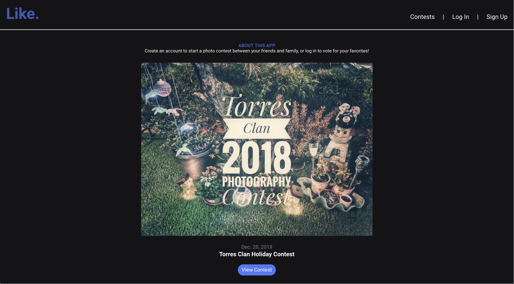
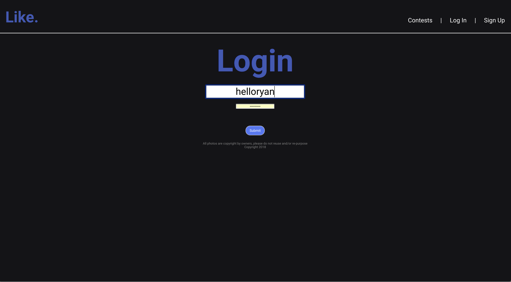
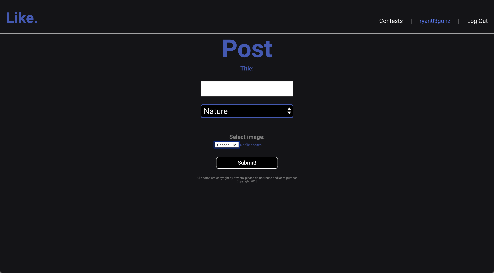

# Like. - Photo Contest
"Like. Photo Contest" is a web-based photo contest app where you can invite your friends and family to upload photos from your computer or mobile device onto the web-hosted database. You have the ability to vote on photos by liking the posts or say what's on your mind by adding a comment. You can browse through all your posts and posts from previous contests.

## Technologies Used:
* Python
* Django
    * For the backend, I used Django 
    * I used Python as our main coding language. Using CreateView, UpdateView, and DeleteView, we used class-based functions to perform our CRUD operations.
* HTML
* CSS
* Heroku
    * I used Heroku to host my app.
* boto3
    * I used boto3 to link to my Amazon Web Services account in order to upload photos directly from file.

## Getting Started
### Heroku
[Heroku Link](https://salty-sea-47975.herokuapp.com/)

### Trello Board
[Trello Board](https://trello.com/b/dDPu7Nq6/photo-contest)

### Github
[Github](https://github.com/helloryantg?tab=repositories)

### Next Steps
* Create custom Signup form
* Fix Responsive Design
* Instead of defaulting to a category page when clicking a contest, show a full page of random photos from the current contest.
* Create custom categories
* When the contest has ended, prevent users from posting photos.

